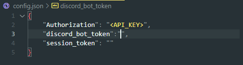
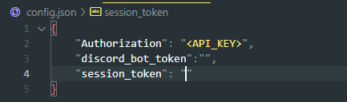

# chatGPT-discord-bot

Reverse Engineered ChatGPT by OpenAI [here](https://github.com/acheong08/ChatGPT).

# Setup

## Install
`pip install -U discord.py`
`pip3 install revChatGPT`

## Create a discord bot

1. Go to https://discord.com/developers/applications create an application.
2. And build a bot under the application.
3. Get the token from Bot setting.

   
4. Store the token to `config.json` under the `discord_bot_token`

   
5. Turn MESSAGE CONTENT INTENT `ON`

   
6. Invite your bot through OAuth2 URL Generator

   

## Get your session token
Go to https://chat.openai.com/chat sign up and log in
1. Open console with `F12`
2. Open `Application` tab > Cookies

   
3. Copy the value for `__Secure-next-auth.session-token` and paste it into `config.json` under `session_token`. You do not need to fill out `Authorization`

   

## Have A Good Chat !

   
