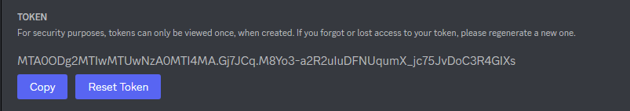
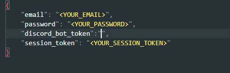
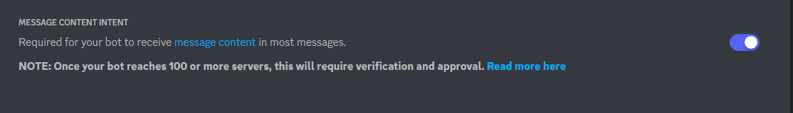
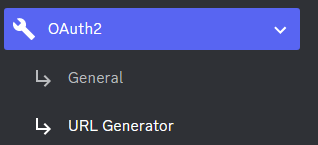
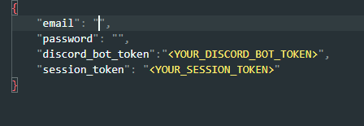
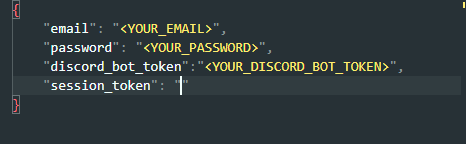

# chatGPT-discord-bot

> ### This is a project that provides you to build your own Discord bot using chatGPT
>
>  :star: A star would be highly appreciated
# Setup

## Install

`pip install -r requirements.txt`

dependencies: Reverse Engineered ChatGPT by OpenAI [here](https://github.com/acheong08/ChatGPT) and discord.py

## Step 1: Create a Discord bot

1. Go to https://discord.com/developers/applications create an application
2. Build a Discord bot under the application
3. Get the token from bot setting

   
4. Store the token to `config.json` under the `discord_bot_token`

   
5. Turn MESSAGE CONTENT INTENT `ON`

   
6. Invite your bot through OAuth2 URL Generator

   
## Step 2: Email and password authentication
Save both in `config.json`

   

> **Warning**
> 
> If you are logging in with a Google or Microsoft account, please use the session token method below.

## Step 2: Session token authentication

Go to https://chat.openai.com/chat log in

1. Open console with `F12`
2. Open `Application` tab > Cookies

   
3. Copy the value for `__Secure-next-auth.session-token` and paste it into `config.json` under `session_token`. You do not need to fill out `email` and `password`

   

## Step 3: Run the bot

1. Open a terminal or command prompt
2. Navigate to the directory where you installed the ChatGPT Discord bot
3. Run `python main.py` to start the bot.

## Chat bot functions

* `! [message]` The bot will respond to you via private message

* `!reset` The bot will be reset

## Have A Good Chat !

   
