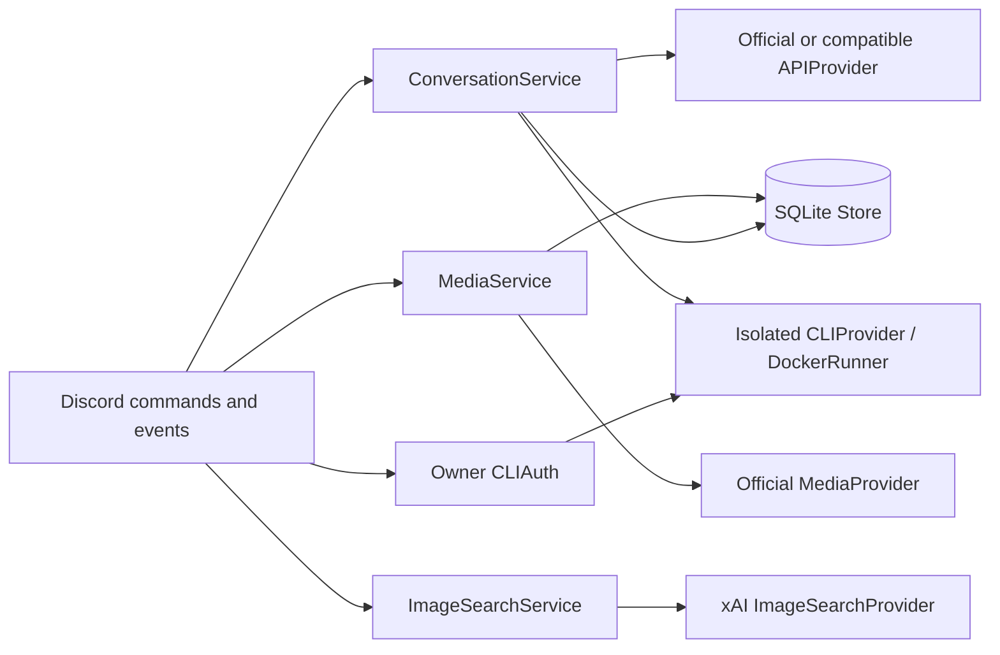

# Architecture and operational decisions

The original Python/discord.py entry point and module responsibilities remain.
Shared mutable client history, implicit provider selection and the polled global
queue were replaced with explicit dependencies and scoped state.

`src/aclient.py` constructs resources in `setup_hook` and closes them on shutdown.
`src/bot.py` supplies slash-command transport and captures the audience before any
request. API clients are not created at import time. Reconnection does not create
extra workers. `src/config.py` validates administrator TOML into backend/model
objects; Discord supplies aliases only.

`src/service.py` owns admission, locking, context budgets and conversation changes.
The same gate covers media, image search and text: a request acquires its conversation lock
before a concurrency slot, so queued turns in one conversation do not occupy
slots needed by unrelated conversations. Locks are removed when no requests use
them. Admission and deadlines bound queued work. Attachment input downloads occur
inside media admission, before any paid submission.

`src/storage.py` stores successful user/assistant pairs atomically as one row
update. Keys hash bot ID, guild/DM namespace, channel/thread ID, user ID and audience.
Persona/model changes preserve retained text but invalidate native sessions. An
exclusive process lock prevents separate bot processes from racing the same DB.
Unknown schemas are rejected before table creation. Retention limits both turns
and inactivity; failed text generations do not enter the history.

`src/providers.py` translates text contracts and owns bounded pooled HTTP clients.
`src/domain.py` defines capabilities and small text/session results. Parameters
are validated against the implemented protocol subset instead of silently being
dropped. No automatic provider fallback exists. Native CLI details and isolated
runtime checks live only in `src/cli.py`; SQLite remains independent of those
native transcripts. The request holds only the matching native UUID and context
fingerprint, and persists session uncertainty before executing externally.

`src/cli_accounts.py` provides local native login administration and an owner-bound
profile containing non-secret revision/status metadata. Account mode requires a
single-user bot. An account lease spans context fingerprinting, native execution
and history commit, preventing a concurrent re-login from attaching an answer to
the wrong account revision. It also serializes native credential refresh across
model aliases and conversations. `runtime/account-runtime.mjs` transfers only
allowlisted native credential files between two bot-owned volumes inside Docker;
transcripts remain scoped to their conversation. Native CLI binaries perform all
authentication and refresh; the Python service never reads OAuth tokens.

`src/cli_auth.py` bounds owner-only account operations by backend, independent of
conversation aliases. Discord always uses a private response. Codex/Grok device
login observes the native subprocess output through a bounded, provider-specific
prompt reader and relays only a validated official URL and user code. No custom
OAuth client is introduced. Claude's native login stays in the local terminal.
Cancellation and shutdown wait for process/container cleanup; authentication
revision changes continue to preserve bot-owned conversation history.

`src/art.py` owns media capabilities, submission records, bounded polling and
artifact retrieval. The job states are `submitting`, `unknown`, `pending`, `failed`,
`ready`, and `delivered`. A crash during submission becomes `unknown`; saved video
operations can be retrieved without another POST. Polling cancellation keeps the
operation. A provider terminal failure becomes `failed`. Image bytes are ephemeral,
so a ready image whose Discord delivery fails is not automatically regenerated.

`src/search.py` sends an explicit current query to xAI image search, without
conversation history. It requires a completed search tool and validates/deduplicates
at most three public HTTPS image URLs. The host does not download these URLs;
Discord renders them through its image proxy. Search shares bounded admission and
cancellation with text/media, while the billing mode and model alias stay explicit.

`utils/message_utils.py` keeps the original Discord transport/audience and disables
mentions. Text longer than 1900 characters becomes one UTF-8 attachment, preserving
code and keeping send counts bounded. Media uses binary attachments with both
administrator and Discord size limits. Buffers close on success and failure.

The design does not provide distributed workers, shared group histories, general agent tools,
streaming chat or automatic provider discovery. Those features need separate
ownership, safety and billing designs. API availability, deployment restrictions
and supported protocol subsets are in [provider support](providers.md) and
[CLI setup](cli.md).
